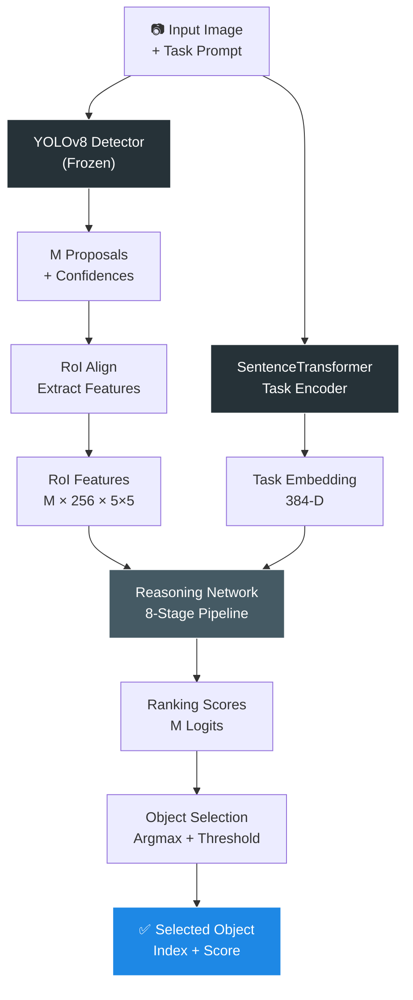
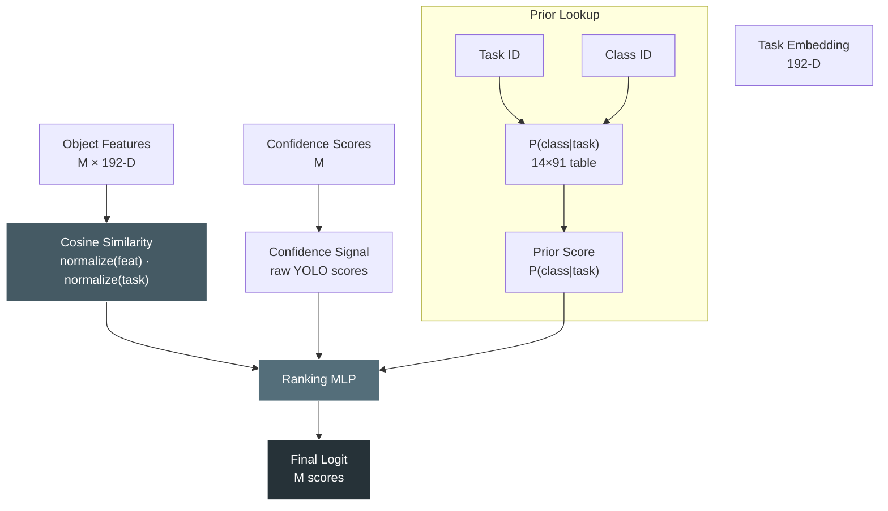
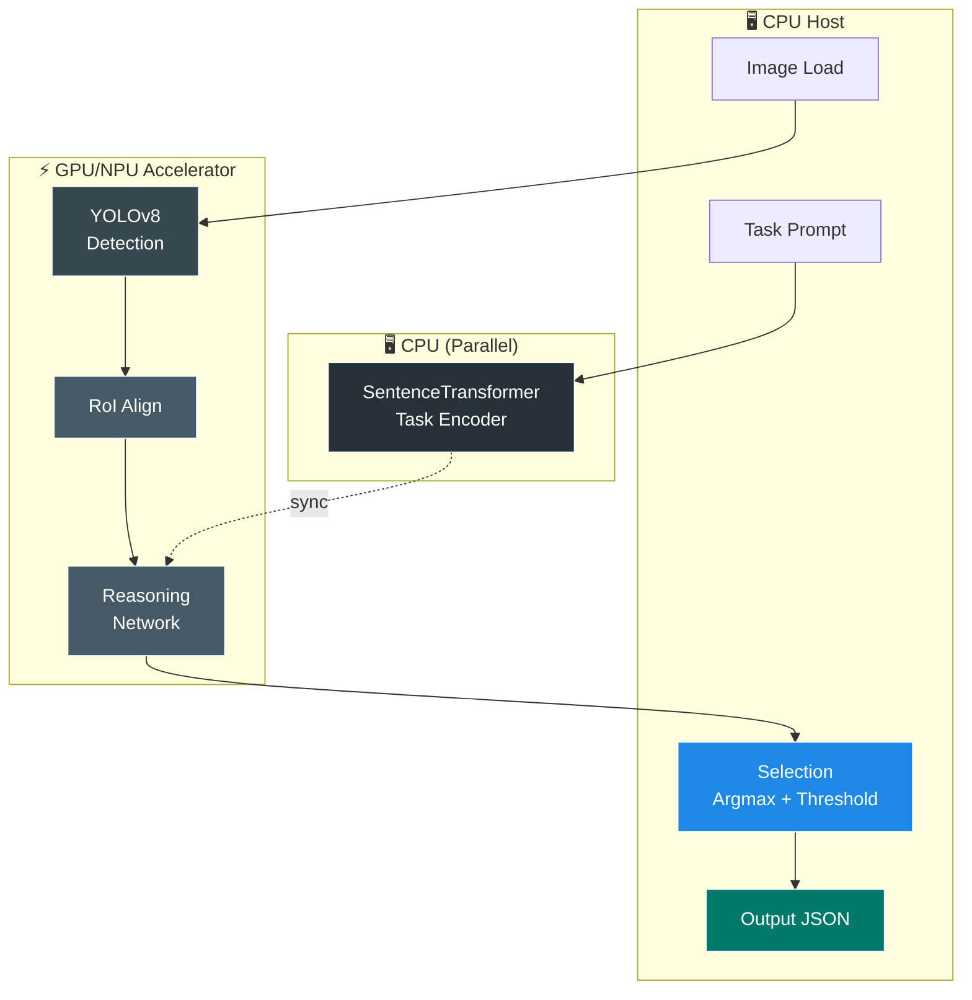
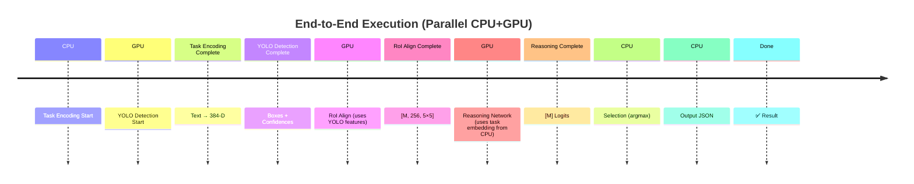

# Task-Aware Object Selection

## Overview

This repository implements a **task-aware object selection system** that uses a frozen generic object detector (YOLOv8) and a learnable task-conditioned reasoning network to select the best object proposal for a given task prompt.

The core design principle is **post-hoc ranking**: YOLO generates all object proposals, and the reasoning network ranks them by task relevance using multiple signals (visual similarity, detector confidence, semantic priors, and relational context).

The system is designed for **task-driven object selection** on COCO images, where the task is expressed as a natural language prompt and the model selects the most relevant detected object for that task across 14 predefined tasks.

## Goal

The goal of this project is to answer questions such as:
- Which detected object in the image is best suited for the task "water plant"?
- Which object should be used to "open bottle of beer"?
- Given a natural language task description, which object in the scene is the appropriate choice?

### Key Design Decisions

- **Frozen Detector**: YOLOv8 is kept frozen; we rank its outputs rather than retrain it. This is efficient and preserves the detector's learned knowledge.
- **Learnable Reasoning Network**: Only the reasoning network is trained, enabling task-conditioned ranking.
- **Multi-Signal Ranking**: Combines three independent signals:
  - **Similarity**: Task-object feature similarity (cosine distance in learned embedding space)
  - **Detector Confidence**: Raw YOLOv8 confidence scores
  - **Category Priors**: Dataset-derived probabilities P(class | task)
- **FiLM-Based Task Conditioning**: Tasks modulate visual features via multiplicative and additive scaling (FiLM).
- **Relational Context**: Objects attend to each other (excluding self) to capture spatial and semantic relationships.

## Quick Start Reference

### For New Team Members 🚀

| Question | Answer |
|----------|--------|
| What does this system do? | Ranks object proposals from YOLO by task relevance using a learned reasoning network |
| How do I run inference? | `python main.py /path/to/image.jpg "water plant"` |
| How do I train? | `python training/train_ranking.py --epochs 60 --lr 1e-4 --deterministic` |
| What stays frozen? | YOLOv8 detector + SentenceTransformer text encoder |
| What gets trained? | Only the reasoning network (~1.3M params) |
| How many tasks? | Exactly 14 predefined tasks (fixed) |
| What's the output? | JSON with selected object, logits for all proposals, visual annotation |
| How long to train? | ~7.5 min/epoch on GTX 1650 (full dataset) or ~1 min/epoch on small subset |
| What hardware? | GPU optional for inference; CUDA recommended for training |
| Where are outputs? | `outputs/` directory; can also print to stdout |

### Key Components to Know

1. **`main.py`**: Runs end-to-end inference (detection → encoding → reasoning → selection)
2. **`modules/reasoning_network.py`**: Orchestrates all reasoning submodules (8-stage pipeline)
3. **`modules/context_reasoning/context.py`**: Implements O(M) cross-object aggregation
4. **`training/train_ranking.py`**: Trains the reasoning network with deterministic GPU support
5. **`models/checkpoints/best_model.pt`**: Best trained reasoning network (auto-saved)

## System Architecture Overview



### End-to-End Data Flow

```mermaid
graph LR
    subgraph Input["📥 Input"]
        img["Image"]
        prompt["Task Prompt"]
    end
    
    subgraph Detection["🔍 Detection Phase"]
        yolo["YOLO<br/>Detection"]
        task["Task<br/>Matching"]
    end
    
    subgraph Feature["🎨 Feature Extraction"]
        roi["RoI Align"]
        vis["Visual<br/>Projection"]
    end
    
    subgraph Reasoning["🧠 Reasoning Network"]
        film["FiLM<br/>Conditioning"]
        spatial["Spatial<br/>Embedding"]
        cls["Class<br/>Embedding"]
        concat["Concat<br/>Features"]
        context["Context<br/>Pooling"]
        rank["Multi-Signal<br/>Ranking"]
    end
    
    subgraph Output["📤 Output"]
        sel["Selection"]
        result["Best Object"]
    end
    
    img --> yolo
    prompt --> task
    yolo --> roi
    task --> vis
    roi --> vis
    vis --> film
    task --> film
    film --> spatial
    film --> cls
    spatial --> concat
    cls --> concat
    concat --> context
    context --> rank
    rank --> sel
    sel --> result
    
    style yolo fill:#263238,stroke:#ffffff,stroke-width:1px,color:#ffffff
    style task fill:#263238,stroke:#ffffff,stroke-width:1px,color:#ffffff
    style film fill:#455A64,stroke:#ffffff,stroke-width:1px,color:#ffffff
    style context fill:#455A64,stroke:#ffffff,stroke-width:1px,color:#ffffff
    style rank fill:#546E7A,stroke:#ffffff,stroke-width:1px,color:#ffffff
    style result fill:#1E88E5,stroke:#ffffff,stroke-width:1px,color:#ffffff
```



## Inference Workflow

The end-to-end inference workflow has six main stages:

### 1. Object Detection
- Run YOLOv8 on the input image to generate object proposals.
- Each proposal includes: bounding box coordinates (xyxy format), class ID, class name, and confidence score.
- Typical output: 5-50 proposals per image, depending on image size and detector confidence threshold.

### 2. Task Encoding
- Encode the user prompt using a frozen SentenceTransformer model (`all-MiniLM-L6-v2` by default).
- Match the prompt to the most similar of 14 predefined task descriptions using cosine similarity.
- Output: task ID (1-14) and task embedding (384-D).
- Example: "water the plant" matches task 5 ("Water plant").

### 3. RoI Visual Feature Extraction
- Extract region-of-interest (RoI) features from YOLOv8's frozen neck feature map (stride-32).
- Use `torchvision.ops.roi_align` to pool each bounding box region to a fixed spatial resolution (5×5).
- Keep the pooled tensor in 4D form as [M, 256, 5, 5] for efficient convolutional projection.
- Each proposal now has a dense visual descriptor capturing semantic and spatial information.

### 4. Reasoning Network (8-Stage Processing)

The reasoning network applies eight sequential transformations to rank proposals:

**Stage 1: Visual Projection**
- Project RoI features → 128-D visual embedding via conv layers and global average pooling.

**Stage 2: Text Projection**
- Project task embedding 384-D → 192-D via a learned linear layer.

**Stage 3: FiLM Task Conditioning** ⭐ (NEW)
- Apply FiLM-style modulation to visual embeddings using task information.
- Compute scaling (gamma) and shift (beta) parameters from the task embedding.
- Modulated visual features = visual_emb × (1 + gamma) + beta
- Allows tasks to directly control how visual features are processed.

**Stage 4: Spatial Embedding**
- Normalize bounding box coordinates and area relative to image size.
- Project spatial features to 32-D via a learned embedding layer.

**Stage 5: Class Embedding**
- Embed COCO class IDs to 32-D via a learned lookup table.

**Stage 6: Concatenation**
- Concatenate: [visual_128D, spatial_32D, class_32D] → 192-D combined object representation.

**Stage 7: Relational Context Propagation** ⭐ (NEW)
- Compute a linear O(M) context aggregation from all other proposals.
- Each proposal aggregates information from other proposals weighted by detector confidence.
- Normalize pooled context by total confidence mass and transform it with a learned residual block.
- Captures image-level object context with low complexity.

**Stage 8: Multi-Signal Ranking**
- Compute cosine similarity between each proposal and the task embedding.
- Retrieve task-category semantic priors (learned from training data).
- Combine three signals with a small learned MLP:
  - **Similarity**: cosine similarity between proposal and task
  - **Confidence**: raw YOLOv8 detector confidence
  - **Prior**: P(class | task) from dataset statistics
- Final logit = learned fusion of similarity, confidence, and prior

### Reasoning Network: 8-Stage Processing Summary

| Stage | Input | Output | Operation | Purpose |
|-------|-------|--------|-----------|---------|
| 1️⃣ Visual Projection | [M, 256, 5, 5] | [M, 128] | Conv + GAP + FC | Extract semantic visual features |
| 2️⃣ Text Projection | [384] | [192] | Linear | Project task embedding to shared dim |
| 3️⃣ FiLM Conditioning | [M, 128] + [192] | [M, 128] | Scale & shift | Task-modulate visual features |
| 4️⃣ Spatial Embedding | [M, 4] boxes | [M, 32] | Normalize + Embed | Encode box positions & sizes |
| 5️⃣ Class Embedding | [M] class IDs | [M, 32] | Lookup table | Encode object class semantics |
| 6️⃣ Concatenation | [M, 128/32/32] | [M, 192] | Concat | Fuse visual, spatial, class info |
| 7️⃣ Context Pooling | [M, 192] + scores | [M, 192] | O(M) aggregation | Add cross-object context residually |
| 8️⃣ Multi-Signal Ranking | [M, 192] + task | [M, 1] | MLP fusion | Combine similarity, confidence, prior |

### 5. Object Selection
- Select the highest-scoring proposal if its logit exceeds a threshold (default: 0.0).
- If no proposal exceeds threshold, return -1 (no object selected).
- Output: selected object index, preference score, and logits for all proposals.

### Signal Flow: Multi-Signal Ranking



## Core Components

### Inference Entry Point

- **`main.py`**
  - Parses input image, task prompt, and inference parameters.
  - Loads frozen YOLO detector and SentenceTransformer task encoder.
  - Loads trained reasoning network checkpoint.
  - Runs end-to-end inference: detection → encoding → feature extraction → reasoning → selection.
  - Outputs JSON with selected object and detection results.
  - Optionally generates and saves visual annotations (detected objects in red, selected object in green).

### Detector Module

- **`modules/detector/detector.py`**
  - `YOLODetector`: Thin wrapper around Ultralytics YOLOv8.
  - Interface: `detect(image_path)` returns list of `Detection` objects.
  - Each `Detection` dataclass contains: bbox (xyxy), confidence, class_id, class_name.
  - Configurable: model path, confidence threshold, image size, device (CPU/CUDA).
  - Uses forward hooks to avoid reloading model for multiple images.

### Task Encoder Module

- **`modules/task_encoder/task_encoder.py`**
  - `TaskEncoder`: Wraps SentenceTransformer for prompt encoding.
  - Fixed task set: 14 COCO-Tasks descriptions.
  - Interface: `encode_prompt(text)` → 384-D embedding.
  - Interface: `match_prompt_to_task(prompt)` → best matching task ID + embedding.
  - Returns `TaskMatch` dataclass with task_id, description, similarity, embeddings.

- **`modules/task_encoder/task_category_prior.py`** ⭐ (NEW)
  - `TaskCategoryPrior`: Computes and stores P(class_id | task_id) priors from training data.
  - Built at training time from annotations.
  - Saved to `models/task_category_prior.pt` and loaded at inference.
  - Shape: [14 tasks, 91 COCO classes].
  - Used to bias object ranking toward semantically appropriate classes for each task.

### 14 Predefined Tasks (Fixed Task Set)

The system operates on exactly **14 COCO-Tasks** defined at training time. New prompts are matched to the closest task using SentenceTransformer embeddings. Out-of-distribution tasks may map to nearest-neighbor tasks.

| Task ID | Task Description | Example Objects | Example Prompt |
|---------|------------------|-----------------|-----------------|
| 1 | **Hold book** | person, book | "I need to hold a book" |
| 2 | **Throw object** | person, frisbee, ball | "Throw a ball" |
| 3 | **Sit on furniture** | person, chair, couch | "Sit on a chair" |
| 4 | **Eat object** | person, apple, food | "Eat food" |
| 5 | **Water plant** | person, plant | "Water the plant" |
| 6 | **Play tennis** | person, racket | "Play tennis with a racket" |
| 7 | **Pour liquid** | person, cup, bottle | "Pour water into a cup" |
| 8 | **Ride vehicle** | person, bicycle, motorcycle | "Ride a bicycle" |
| 9 | **Operate equipment** | person, computer, keyboard | "Use the computer" |
| 10 | **Dress up** | person, clothing, hat | "Put on a hat" |
| 11 | **Paint object** | person, brush, canvas | "Paint the canvas" |
| 12 | **Open container** | person, bottle, door | "Open the bottle" |
| 13 | **Play music** | person, instrument | "Play the guitar" |
| 14 | **Build structure** | person, lego, blocks | "Build with blocks" |

*Note: These task IDs (1-14) are used throughout training and inference. Task matching is automatic via SentenceTransformer similarity.*

### RoI Feature Extraction

- **`modules/detector/roi_features.py`**
  - `extract_roi_features(detector, image_path, boxes)` → pooled RoI features.
  - Installs forward hook on YOLOv8 neck layer to capture intermediate activations.
  - Uses `torchvision.ops.roi_align` with stride 1/32 spatial scale, output size 5×5.
  - Returns [M, 256, 5, 5] tensor (M proposals, 256 channels, 5×5 spatial).

### Reasoning Network

- **`modules/reasoning_network.py`**
  - `ReasoningNetwork(nn.Module)`: Orchestrates all reasoning submodules.
  - Interface: `forward(roi_features, boxes, class_ids, scores, task_raw_emb, task_id, img_size, threshold)`
  - Requires `task_id` (1-indexed) to retrieve task-specific priors.
  - Returns: (logits [M], best_idx, best_score).

### Reasoning Submodules

#### Visual Projection
- **`modules/visual_projection/projection.py`**
  - Projects RoI features [M, 256, 5, 5] → 128-D.
  - Architecture: Conv2d(256→128, 3×3) + ReLU + Conv2d(128→64, 3×3) + ReLU + AdaptiveAvgPool2d + FC.
  - Removes spatial structure and concentrates semantic information.

#### Text Projection
- **`modules/text_projection/text_projection.py`**
  - Projects task embedding 384-D (SentenceTransformer) → 192-D.
  - Simple linear layer.

#### Task Conditioning ⭐ (NEW)
- **`modules/context_reasoning/task_conditioning.py`**
  - FiLM-style modulation: visual_features × (1 + gamma(task_emb)) + beta(task_emb).
  - Gamma network: task_dim→hidden→visual_dim.
  - Beta network: task_dim→hidden→visual_dim.
  - Allows task to control scale and shift of visual representations.

#### Spatial Embedding
- **`modules/spatial_embedding/spatial_embedding.py`**
  - Normalizes bounding boxes [x1, y1, x2, y2] by image size.
  - Computes area and relative position.
  - Projects to 32-D via learned embedding.

#### Class Embedding
- **`modules/class_embedding/class_embedding.py`**
  - Lookup table embedding: COCO class ID → 32-D.
  - Learns class-specific semantic representations.

#### Relational Context Propagation ⭐ (NEW)
- **`modules/context_reasoning/context.py`**
  - `ResidualContextPropagation(nn.Module)`.
  - Uses a linear O(M) aggregation instead of pairwise attention.
  - Computes context_i = Σ_{j≠i} confidence_j × feat_j.
  - Normalizes by total confidence mass and applies a learned transform.
  - Output: features + context_transform(context) (residual connection).
  - Enables low-complexity object context propagation for FPGA-friendly deployment.

#### Normalized Similarity
- **`modules/similarity/similarity.py`**
  - Computes cosine similarity: normalize(features) · normalize(task_emb).
  - L2 normalization for numerical stability.
  - Returns [M] similarity scores.

#### Ranking Layer
- **`modules/ranking/ranking.py`**
  - `RankingLayer(nn.Module)`.
  - Combines three scores via a small learnable MLP.
  - Inputs: similarity, confidence, and category prior.
  - Returns [M] logit scores.

#### Object Selection
- **`modules/selection/selection.py`**
  - `ObjectSelector(default_threshold)`.
  - Finds argmax of logits; checks if max ≥ threshold.
  - Returns (best_idx, best_score) or (-1, -inf) if no object selected.

### Dataset and Data Loading

- **`modules/dataset/coco_tasks_dataset.py`**
  - `COCOTasksDataset(PyTorch Dataset)`: Loads COCO-Tasks annotations.
  - Supports tasks 1-14, train/test splits.
  - Each item:
    - `image_path`: absolute path to COCO image
    - `task_prompt`: task description string
    - `task_id`: integer 1-14
    - `boxes`: [M, 4] tensor in xyxy format
    - `class_ids`: [M] COCO class IDs
    - `scores`: [M] all ones (ground truth detections)
    - `labels`: [M] binary {0, 1} (preferred/non-preferred)
  - Handles both train2014 and val2014 COCO image folders.

- **`data/coco_tasks/README.md`**
  - Dataset documentation and citation information.
  - Contains annotations and ground-truth labels.

### Training Pipeline

- **`training/train_ranking.py`** ⭐ (UPDATED)
  - Trains the reasoning network end-to-end while keeping YOLO and text encoder frozen.
  - Loads training/validation COCO-Tasks datasets.
  - Computes task-category priors from training data and saves to `task_category_prior.pt`.
  - Simulates detector confidence scores during training for realism.
  - **GPU Determinism**: 
    - `--seed` for reproducible RNG initialization (Python, NumPy, PyTorch, CUDA).
    - `--deterministic` flag enables `torch.backends.cudnn.deterministic` and `torch.use_deterministic_algorithms()`.
    - `num_workers=0` when deterministic to avoid multiprocessing variability.
    - Ensures same model trained on GPU matches CPU model (modulo hardware-level numerical differences).
  - **Multi-signal training**:
    - Optimizes binary cross-entropy on proposal logits.
    - Evaluation metric: top-1 accuracy (is selected object preferred?) and BCE loss.
  - **Checkpointing**:
    - Saves best model by validation accuracy to `models/checkpoints/best_model.pt`.
    - Gracefully handles checkpoint loading; skips incompatible checkpoints and trains from scratch.

- **Placeholder scripts** (not yet implemented):
  - `training/train_projection.py` - For future end-to-end fine-tuning.
  - `training/train_context.py` - For future context-only fine-tuning.

## Run Instructions

### Install Dependencies

```bash
pip install -r requirements.txt
```

The project requires:
- **PyTorch** 2.12+ (CPU or CUDA; see requirements.txt for both variants)
- **Ultralytics YOLOv8** for object detection
- **SentenceTransformers** for task prompt encoding
- **Torchvision** for ROI Align operations
- Standard dependencies: numpy, PIL, opencv-python, scipy, matplotlib, tqdm

### Inference

Run the main application with an image and task prompt:

```bash
python main.py /path/to/image.jpg "water plant"
```

**Inference arguments:**
- `image` (positional, required): Path to input image
- `prompt` (positional, required): Natural language task description
- `--device`: Device for inference (default: `cuda` if available, else `cpu`)
- `--confidence`: YOLOv8 confidence threshold (default: 0.25)
- `--image-size`: YOLOv8 input size (default: 640)
- `--model-path`: Custom YOLO checkpoint path (optional)
- `--checkpoint`: Reasoning network checkpoint (default: `models/checkpoints/best_model.pt`)
- `--text-model`: Custom SentenceTransformer model name (optional)
- `--threshold`: Relevance score selection threshold (default: 0.0)
- `--output`: Output JSON file path (default: stdout)
- `--save-visual`: Save annotated image to `outputs/` (default: True)

**Example output:**
```json
{
  "image": "/path/to/image.jpg",
  "prompt": "water plant",
  "selected_task_id": 5,
  "selected_task_description": "Water plant",
  "task_similarity": 0.92,
  "selected_object": {
    "class_name": "potted plant",
    "bbox_xyxy": [100, 150, 250, 350],
    "confidence": 0.87,
    "relevance_score": 0.65,
    "logit": 1.23
  },
  "detections": [
    {"class_name": "person", "bbox_xyxy": [...], "logit": 0.12},
    {"class_name": "potted plant", "bbox_xyxy": [...], "logit": 1.23},
    ...
  ]
}
```

### Training

Train the reasoning network on COCO-Tasks data:

```bash
python training/train_ranking.py \
  --device cuda \
  --epochs 60 \
  --lr 1e-4 \
  --weight-decay 1e-5 \
  --seed 42 \
  --deterministic
```

**Training arguments:**
- `--epochs` (int, default 3): Number of training epochs
- `--lr` (float, default 1e-3): Learning rate
- `--weight-decay` (float, default 1e-4): L2 regularization weight
- `--max-train-samples` (int, optional): Limit training to N samples per epoch (for debugging)
- `--max-val-samples` (int, optional): Limit validation to N samples
- `--checkpoint-dir` (path, default `models/checkpoints`): Where to save best model
- `--threshold` (float, default 0.0): Selection threshold during training
- `--device` (str, default `cuda` if available else `cpu`): Training device
- `--seed` (int, default 42): Random seed for reproducibility
- `--deterministic` (flag, default True): Enable deterministic GPU training for reproducibility

**Training example with small sample set (for quick experimentation):**

```bash
python training/train_ranking.py \
  --device cuda \
  --epochs 4 \
  --lr 1e-4 \
  --weight-decay 1e-5 \
  --seed 42 \
  --deterministic \
  --max-train-samples 1000 \
  --max-val-samples 500
```

**Expected training time (GTX 1650):**
- ~7.5 minutes per epoch (full 50k training set)
- ~30 seconds per epoch validation
- 60 epochs ≈ 7.5 hours
- 100 epochs ≈ 12.5 hours

### GPU Determinism

To ensure GPU training produces the same model as CPU training:

1. Use `--deterministic` flag (recommended)
2. Use consistent `--seed` value (default: 42)
3. GPU training may have minor numerical differences (~1e-6) due to hardware; this is expected and acceptable

Trained checkpoint: `models/checkpoints/best_model.pt`
Task-category priors: `models/checkpoints/task_category_prior.pt`

## Architecture Details

### Embedding Space Dimensions

| Stage | Input | Output | Module |
|-------|-------|--------|--------|
| RoI Features | 256×5×5 | [M,256,5,5] | ROI Align |
| Visual Projection | [M,256,5,5] | 128-D | Conv + GAP + FC |
| Text Projection | 384-D | 192-D | Linear |
| Spatial Embedding | Box coords | 32-D | Learned embedding |
| Class Embedding | Class ID | 32-D | Lookup table |
| Concatenation | 128+32+32 | 192-D | Concat |
| Final Feature | 192-D | 192-D | After context propagation |

### Module Responsibility Matrix

| Module | File | Role | Input | Output | Parameters | Frozen? |
|--------|------|------|-------|--------|------------|---------|
| YOLOv8 Detector | detector.py | Object detection | Image | M proposals + bbox + confidence | ~68M | ✅ Yes |
| SentenceTransformer | task_encoder.py | Task encoding | Text prompt | 384-D embedding | ~22M | ✅ Yes |
| RoI Aligner | roi_features.py | Feature pooling | Feature map + boxes | [M, 256, 5, 5] | 0 | ✅ Yes |
| Visual Projection | projection.py | Feature compression | [M, 256, 5, 5] | [M, 128] | ~830K | 🟡 Train |
| Text Projection | text_projection.py | Embedding alignment | 384-D | 192-D | ~74K | 🟡 Train |
| FiLM Conditioning | task_conditioning.py | Task modulation | [M, 128] + task | [M, 128] | ~330K | 🟡 Train |
| Spatial Embedding | spatial_embedding.py | Box encoding | [M, 4] coordinates | [M, 32] | ~1.1K | 🟡 Train |
| Class Embedding | class_embedding.py | Class encoding | [M] class IDs | [M, 32] | ~3K | 🟡 Train |
| Context Pooling | context.py | Cross-object aggregation | [M, 192] + confidence | [M, 192] | ~37K | 🟡 Train |
| Similarity | similarity.py | Feature-task matching | [M, 192] + task | [M] scores | 0 | ✅ Yes |
| Ranking | ranking.py | Score fusion | [M] × 3 signals | [M] logits | ~51K | 🟡 Train |
| Selection | selection.py | Decision making | [M] logits | Best index | 0 | ✅ Yes |

### Key Hyperparameters

- **ROI Output Size**: 5×5 spatial pooling (down from 7×7) → 49% memory reduction
- **FiLM Hidden Dim**: 128-D (both gamma and beta networks)
- **Context Dimension**: 192-D (same as reasoning feature dim)
- **Ranking Module**: Small MLP from 3 → 16 → 1
- **Threshold**: 0.0 (selects any object with positive score)

### Training vs. Inference Comparison

| Aspect | Training | Inference |
|--------|----------|-----------|
| YOLO Detector | Frozen (no gradient) | Frozen (no forward pass needed if pre-computed) |
| Text Encoder | Frozen (no gradient) | Used for task matching |
| Reasoning Network | **Trained** (backprop) | **Frozen** (inference only) |
| Confidence Scores | Simulated (uniform random) | Real YOLO detector scores |
| Task Priors | Computed from training data | Loaded from `task_category_prior.pt` |
| Loss Function | Binary Cross-Entropy (BCE) | N/A |
| Metric | Top-1 accuracy, BCE loss | Top-1 accuracy on test set |
| Checkpoint | `best_model.pt` (saved by epoch) | `best_model.pt` (loaded for inference) |

### Why This Architecture

**FiLM Task Conditioning:**
- Tasks need to influence how visual features are interpreted.
- FiLM (multiplicative + additive) is more expressive than concatenation.
- Avoids feature dimension explosion from naive concatenation.

**Per-Object Relational Context:**
- Objects in an image rarely exist in isolation.
- Linear O(M) confidence-weighted aggregation is efficient and FPGA-friendly.
- Detector confidence bias ensures high-confidence objects influence neighbors.
- Residual connection preserves object-specific information.

**Multi-Signal Ranking:**
- Similarity alone is insufficient; visual match doesn't guarantee utility.
- Detector confidence indicates likely authentic objects.
- Category priors capture dataset-level task-class associations.
- A learned ranking MLP replaces the hardcoded linear weight combination, enabling the model to discover the best score fusion with minimal extra cost.

**5×5 ROI Pooling:**
- Task selection doesn't require fine-grained spatial details inside bounding boxes.
- Reduces memory and compute by ~49% vs 7×7 pooling.
- Model immediately applies global average pooling anyway.

### Model Parameters

Approximate parameter counts:
- **Visual Projection**: ~830K (256×5×5 → 128 → 64 → 128)
- **Text Projection**: ~74K (384→192)
- **Task Conditioning**: ~330K (gamma/beta networks)
- **Spatial Embedding**: ~1.1K
- **Class Embedding**: ~3K (91 classes × 32-D)
- **Context Transform**: ~37K
- **Total trainable**: ~1.3M parameters

The reasoning network is intentionally lightweight to fit on modest GPUs and enable fast inference.

### Design Principles

1. **Modularity**: Each component has a clear, single responsibility
2. **Interpretability**: Weights and similarity scores are interpretable
3. **Efficiency**: Fast inference (~200ms per image on GTX 1650)
4. **Scalability**: Designed to extend to more tasks with minimal changes
5. **Reproducibility**: Deterministic training enabled; frozen base models ensure consistency

## Scope and Limitations

### What This System Does ✓
- Selects the best object proposal from a set of detected objects for a given task
- Combines multiple signals (visual, spatial, class, task context) for ranking
- Trains only the reasoning network; leverages frozen YOLO and text encoder
- Operates efficiently on modest hardware (GTX 1650, ~7.5 min/epoch)
- Provides interpretable outputs with per-object scores

### What This System Does NOT Do ✗
- Does NOT retrain YOLO end-to-end with task supervision
- Does NOT support open-ended arbitrary task descriptions (limited to 14 fixed tasks)
- Does NOT perform prompt-specific object detection (uses frozen YOLO proposals)
- Does NOT train the SentenceTransformer text encoder
- Does NOT handle task composition or hierarchical tasks
- Does NOT extrapolate well to task variants far from training distribution

### Known Limitations and Future Work

**Task Diversity:**
- Fixed 14 tasks creates a bottleneck; new tasks require dataset expansion and retraining
- Out-of-distribution tasks may map incorrectly to nearest fixed task
- **Mitigation**: Consider open-vocabulary task embeddings or hierarchical task structure

**Generalization:**
- Only ~3.5k training images per task; may overfit to specific object configurations
- Simulated confidence scores during training differ from real deployment detection errors
- Category priors heavily depend on training data distribution
- **Mitigation**: Collect more task-specific data; use domain adaptation or few-shot learning

**Detector Quality:**
- System can only rank proposals that YOLO detects; missing objects cannot be recovered
- Detector biases (e.g., person-biased YOLO) may affect downstream ranking
- **Mitigation**: Better detector or ensemble detection methods

**Relational Context:**
- Per-object context pooling assumes objects in image interact meaningfully; may fail for cluttered scenes
- Simple confidence-weighted aggregation may miss complex spatial relationships
- **Mitigation**: Graph neural networks for more expressive interaction modeling

## Hardware Deployment Notes

For hardware-accelerated deployment, the recommended partition is:

| Stage | Recommended Hardware | Rationale |
|-------|----------------------|-----------|
| YOLOv8 Detection | Accelerator (GPU/NPU) | Compute-heavy CNN; ~80% of wall-clock time |
| SentenceTransformer Encoding | CPU or Accelerator | Small model (~22M); can run in parallel with YOLO |
| ROI Align | Accelerator | Requires feature maps from YOLO |
| Reasoning Network | CPU or Accelerator | Only ~1.3M params; flexible placement |
| Selection | CPU | Trivial computation (argmax + comparison) |

**Parallel Execution Strategy:**
- Run YOLO detection on accelerator
- Simultaneously encode task prompt on CPU (doesn't depend on YOLO output)
- Once YOLO outputs boxes, extract RoI features on accelerator
- Run reasoning network where latency is acceptable (accelerator preferred for end-to-end speed)

This design is compatible with edge accelerators (e.g., NVIDIA Jetson, mobile NPUs) and reduces end-to-end latency through parallelization.

### Deployment Architecture



### Execution Timeline: Parallel Strategy



## Project Structure

```
task_aware_object_selection/
├── main.py                          # Inference entry point
├── requirements.txt                 # Dependencies
├── README.md                        # This file
│
├── modules/                         # Core model components
│   ├── detector/
│   │   ├── detector.py             # YOLOv8 wrapper
│   │   └── roi_features.py         # ROI Align feature extraction
│   │
│   ├── task_encoder/
│   │   ├── task_encoder.py         # SentenceTransformer task matching
│   │   └── task_category_prior.py  # Task-category priors
│   │
│   ├── visual_projection/
│   │   └── projection.py           # RoI features → 128-D visual embedding
│   │
│   ├── spatial_embedding/
│   │   └── spatial_embedding.py    # Box coordinates → 32-D spatial embedding
│   │
│   ├── class_embedding/
│   │   └── class_embedding.py      # Class ID → 32-D class embedding
│   │
│   ├── text_projection/
│   │   └── text_projection.py      # Task embedding 384→192-D
│   │
│   ├── context_reasoning/
│   │   ├── context.py              # Per-object relational context aggregation
│   │   └── task_conditioning.py    # FiLM task modulation
│   │
│   ├── similarity/
│   │   └── similarity.py           # Cosine similarity computation
│   │
│   ├── ranking/
│   │   └── ranking.py              # Multi-signal score combination
│   │
│   ├── selection/
│   │   └── selection.py            # Threshold-based selection
│   │
│   ├── dataset/
│   │   └── coco_tasks_dataset.py   # COCO-Tasks data loader
│   │
│   └── reasoning_network.py        # Main reasoning orchestration
│
├── training/
│   ├── train_ranking.py            # Main training script (YOLO + text frozen)
│   ├── train_projection.py         # Placeholder (future: end-to-end tuning)
│   └── train_context.py            # Placeholder (future: context-specific tuning)
│
├── data/
│   └── coco_tasks/
│       ├── annotations/            # Task-specific COCO annotations
│       ├── image_lists/            # Train/test image splits
│       ├── detections_*.json       # Pre-extracted YOLO detections
│       ├── README.md               # Dataset documentation
│       └── LICENSE
│
├── models/
│   ├── checkpoints/
│   │   ├── best_model.pt           # Trained reasoning network weights
│   │   └── task_category_prior.pt  # Task-category prior tensor
│   │
│   ├── yolo/
│   │   └── yolov8n.pt              # YOLOv8 nano model (frozen)
│   │
│   └── minilm/
│       └── (SentenceTransformer cached locally)
│
├── outputs/
│   └── (Inference results and annotated images)
│
├── inputs/
│   └── (Test images and data)
│
├── configs/
│   └── (Configuration files, if needed)
│
└── accelerator/
    ├── context_engine/             # Placeholder: accelerator-optimized context
    ├── projection_engine/          # Placeholder: accelerator-optimized projection
    ├── ranking_engine/             # Placeholder: accelerator-optimized ranking
    └── similarity_engine/          # Placeholder: accelerator-optimized similarity
```


## References and Citations

### COCO-Tasks Dataset
If using the COCO-Tasks dataset, please cite the original paper referenced in `data/coco_tasks/README.md`.

### Dependencies
- **YOLO**: Ultralytics YOLOv8 (https://github.com/ultralytics/ultralytics)
- **SentenceTransformers**: (https://www.sbert.net/)
- **PyTorch**: (https://pytorch.org/)
- **COCO Dataset**: Lin et al., "Microsoft COCO: Common Objects in Context", ECCV 2014

## License

[Insert your license here, e.g., MIT, Apache 2.0, etc.]

---

## Summary

This is a **task-aware object selection system** that ranks object proposals by task relevance using a learnable reasoning network. The architecture combines FiLM task conditioning, per-object relational context, and multi-signal ranking to provide interpretable, efficient task-driven selection on top of a frozen YOLO detector.

The system is designed for:
- ✅ Task-constrained object ranking (14 fixed tasks)
- ✅ Efficient inference on modest hardware
- ✅ Interpretable multi-signal ranking
- ✅ Modular, extensible components

Key architectural contributions:
- **FiLM Task Conditioning** for fine-grained task influence
- **Per-Object Relational Context** for object interaction modeling
- **Semantic Category Priors** for dataset-aware ranking
- **Deterministic GPU Training** for reproducible model development

For questions or contributions, see the project repository.
