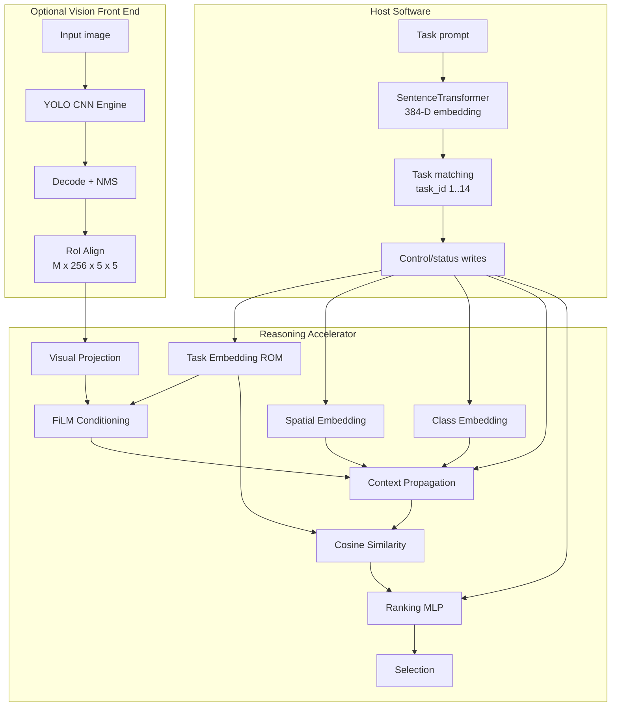
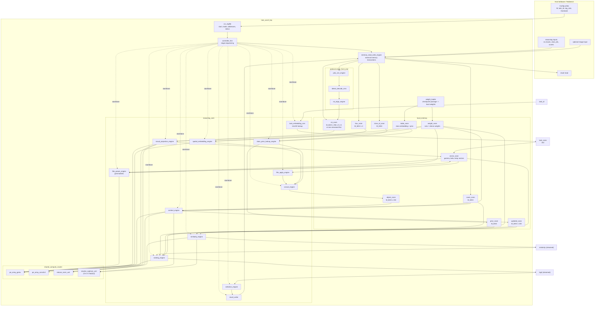
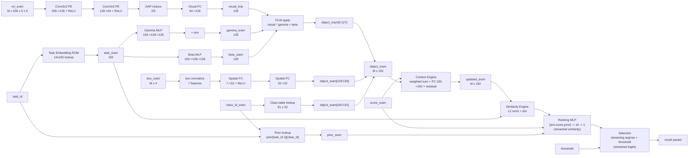
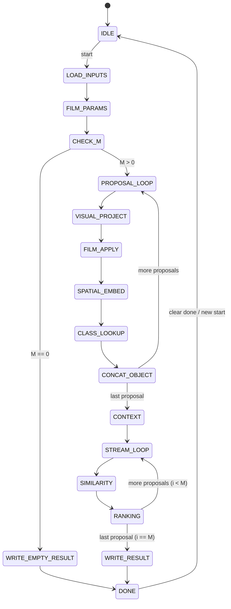

# RTL Design Guide for the Task-Aware Object Selection Accelerator

## 1. Purpose

This document is written for the RTL designer who needs to build the accelerator for this repository.
It explains what to implement, how data moves through the hardware, which PE arrays are needed, how
each block maps to the Python model, and how to verify the RTL against the PyTorch implementation.

The source of truth is the code in:

- `main.py`
- `modules/reasoning_network.py`
- `modules/detector/roi_features.py`
- `modules/visual_projection/projection.py`
- `modules/text_projection/text_projection.py`
- `modules/context_reasoning/task_conditioning.py`
- `modules/spatial_embedding/spatial_embedding.py`
- `modules/class_embedding/class_embedding.py`
- `modules/context_reasoning/context.py`
- `modules/similarity/similarity.py`
- `modules/ranking/ranking.py`
- `modules/selection/selection.py`

This guide is based only on the repository code and README.

## 2. What the Accelerator Must Do

The project selects the best detected object for a task prompt. The software pipeline is:

1. Encode the task prompt with SentenceTransformer into a 384-D vector.
2. Match the prompt to one of 14 fixed task IDs.
3. Run YOLOv8 to detect object proposals.
4. Extract RoI features from a YOLO neck feature map using RoI Align.
5. Run the task-aware reasoning network.
6. Select the highest-scoring object if it passes a threshold.

The RTL design should be built in two practical layers:

| Layer | Name | What It Implements | Why |
|---|---|---|---|
| Layer 1 | Reasoning Accelerator | Stages after RoI Align: visual projection, text projection, FiLM, spatial/class embedding, context, similarity, ranking, selection | Fully defined by this repo and small enough to implement first. |
| Layer 2 | Vision Front End | YOLO CNN engine, detection decode/NMS, RoI Align | Needed for full image-to-result acceleration, but exact YOLO layer schedule must be exported from the chosen YOLO model. |

The most important deliverable is a correct Layer 1 reasoning accelerator. The Layer 2 front end can be
integrated later or replaced by a pre-existing CNN accelerator as long as it produces the tensors defined
in this document.

Because the task set is fixed and the host already resolves prompts to task IDs, the accelerator can be
implemented to accept only `task_id` and use a small ROM of 14 precomputed 192-D task embeddings. This
eliminates the need for a runtime text projection GEMV stage, removes the 384-D task embedding DMA path,
and simplifies verification.

## 3. Implemented Task Set

The accelerator receives `task_id` from software. It does not parse natural language.

| Task ID | Task Description |
|---:|---|
| 1 | Step on something to reach top of a shelf |
| 2 | Sit comfortably |
| 3 | Place flowers |
| 4 | Get potatoes out of fire |
| 5 | Water plant |
| 6 | Get lemon out of tea |
| 7 | Dig hole |
| 8 | Open bottle of beer |
| 9 | Open parcel |
| 10 | Serve wine |
| 11 | Pour sugar |
| 12 | Smear butter |
| 13 | Extinguish fire |
| 14 | Pound carpet |

`task_id` is 1-based in software. Hardware table address is `task_id - 1`.

## 4. Tensor Contract

The reasoning accelerator input/output contract is:

| Signal / Tensor | Shape | Type in PyTorch | Meaning |
|---|---:|---|---|
| `roi_features` | `[M,256,5,5]` | float | RoI-aligned YOLO neck features. |
| `boxes` | `[M,4]` | float | Absolute `[x1,y1,x2,y2]` coordinates. |
| `class_ids` | `[M]` | int | COCO class IDs, address range 0..90. |
| `scores` | `[M]` | float | YOLO confidence score per proposal. |
| `task_raw_emb` | `[384]` | float | Optional SentenceTransformer prompt embedding used only for verification or fallback. Hardware should use `task_id` + ROM task embeddings. |
| `task_id` | scalar | int | 1..14. Selects the precomputed task embedding in hardware. |
| `img_size` | scalar pair | int | `(height,width)`. |
| `threshold` | scalar | float | Minimum selected logit. |
| `logits` | `[M]` | float | Ranking score per proposal. |
| `best_idx` | scalar | int | Selected proposal index, or `-1`. |
| `best_score` | scalar | float | Best logit. |

`M` is variable. RTL must set a maximum proposal count:

```text
parameter M_MAX = 32;  // recommended first implementation
```

If more than `M_MAX` proposals are available, keep the top `M_MAX` by detector confidence before
reasoning. This is a hardware design choice and must be documented in verification results.

## 5. Top-Level Architecture



## 5.1 RTL Circuit Diagrams

These diagrams are block-level RTL circuit diagrams. They are not transistor-level schematics; synthesis
will produce the gate-level netlist. The goal here is to show every hardware module the RTL designer
must instantiate and how those modules connect.

### 5.1.1 Complete Accelerator Circuit



### 5.1.2 Reasoning Core Circuit

This is the main circuit to implement first. It assumes RoI features and detections are already present
in local SRAM.



### 5.1.3 Shared Compute Cluster Circuit

All dense layers use the same GEMV array. Visual convolution uses the convolution array. Reduction,
reciprocal, and rsqrt are shared by the stages that need them.

```text
                       +------------------------------+
 layer command ------->| compute_cluster_scheduler    |
                       +---------------+--------------+
                                       |
       +-------------------------------+-------------------------------+
       |                               |                               |
       v                               v                               v
+---------------+               +---------------+               +---------------+
| pe_array_gemv |               | pe_array_conv |               | reduce_unit   |
| OUT_PAR x     |               | OC_PAR x      |               | adder tree +  |
| IN_PAR MACs   |               | IC_PAR MACs   |               | accumulator   |
+-------+-------+               +-------+-------+               +-------+-------+
        |                               |                               |
         v                               v                               v
 dense outputs                  conv feature maps                 reductions:
 FiLM MLPs                      visual conv1/2                   GAP, sum_score,
 spatial MLP                                                     norms, dot
 context FC (optional)
 ranking MLP

       +------------------------------+
       | newton_raphson_unit          |
       | mode: 1/x or 1/sqrt(x)       |
       +------------------------------+
                     |
                     v
               context scale
               cosine normalize
               spatial reciprocal
               vector norms
```

### 5.1.4 Visual Projection Circuit

This circuit implements `modules/visual_projection/projection.py`.

```text
roi_sram[i][256][5][5]
        |
        v
+-------------------------------+
| conv3x3 input window generator |
| - 5x5 spatial counters         |
| - zero padding logic           |
| - input channel tile counter   |
+-------------------------------+
        |
        v
+-------------------------------+
| pe_array_conv3x3               |
| CONV_OC_PAR output channels    |
| CONV_IC_PAR input channels     |
| 3x3 kernel loop                |
+-------------------------------+
        |
        v
+-------------------------------+
| bias add + ReLU                |
+-------------------------------+
        |
        v
conv1_sram[128][5][5]
        |
        v
same conv3x3 datapath for Conv2
        |
        v
conv2_sram[64][5][5]
        |
        v
+-------------------------------+
| GAP reduction                  |
| sum 25 values per channel      |
| multiply by 1/25               |
+-------------------------------+
        |
        v
gap_vector[64]
        |
        v
+-------------------------------+
| pe_array_gemv                  |
| Linear 64 -> 128               |
+-------------------------------+
        |
        v
visual_tmp[128]
```

Required submodules:

| Submodule | Function |
|---|---|
| `conv_window_gen_5x5` | Generates padded 3x3 windows for a 5x5 tile. |
| `pe_array_conv3x3` | Performs tiled convolution MACs. |
| `relu_clamp` | Applies ReLU after each convolution. |
| `gap_reduce_25` | Computes channel average over 25 spatial elements. |
| `pe_array_gemv` | Computes final 64->128 projection. |

### 5.1.5 Context Engine Circuit

This circuit implements `modules/context_reasoning/context.py`.

```text
object_sram[M][192]       score_sram[M]
        |                       |
        +-----------+-----------+
                    |
                    v
          +---------------------+
          | weighted pass       |
          | weighted_i_d =      |
          | score_i * obj_i_d   |
          +----------+----------+
                     |
       +-------------+-------------+
       |                           |
       v                           v
      sum_weighted[192]         sum_score
                                   |
                                   v
                            newton_raphson_unit
                                   |
                                   v
                              inv_sum_score

for each proposal i:

sum_weighted[192] ----+                  obj_i[192]
                       \                /
                        subtract     multiply
                        /            inv_sum_score
weighted_i[192] -----+                  |
                                           v
                                      context[192]
                                           |
                                           v
                                  optional FC 192->192
                                           |
                                           v
                                      residual add
                                           |
                                           v
                                  updated_sram[i][192]
```

Required submodules:

| Submodule | Function |
|---|---|
| `score_feature_mul` | Multiplies confidence by each 192-D object vector. |
| `context_sum_reduce` | Accumulates `sum_weighted[192]` and `sum_score`. |
| `newton_raphson_unit` | Computes `1 / max(sum_score, epsilon)` or `1 / sqrt(x)`. |
| `context_sub_scale` | Forms `(sum_weighted - weighted_i) / sum_score`. |
| `pe_array_gemv` | Applies the 192->192 context linear layer. |
| `residual_add` | Adds transformed context to original object vector. |

### 5.1.6 Similarity Circuit

This circuit implements `modules/similarity/similarity.py`.

```text
task_sram[192]
     |
     v
+------------------+       +---------------------+
| square + reduce  |------>| newton_raphson_unit | (rsqrt mode)
+------------------+       +-----+---------------+
                                 |
                                 v
                         task_norm_factor
                                 |
task_sram[192] -----------------+----> multiply -> task_norm_sram[192]

for each proposal i:

updated_sram[i][192]
     |
     v
+------------------+       +---------------------+
| square + reduce  |------>| newton_raphson_unit | (rsqrt mode)
+------------------+       +-----+---------------+
                                 |
                                 v
                         obj_norm_factor
                                 |
updated_sram[i][192] -----------+----> multiply -> obj_norm_stream[192]
                                                  |
task_norm_sram[192] ------------------------------+
                                                  v
                                           dot_product_reduce
                                                  |
                                                  v
                                              sim[i] (streamed)
```

Required submodules:

| Submodule | Function |
|---|---|
| `square_reduce_192` | Computes sum of squares for a 192-D vector. |
| `newton_raphson_unit` | Computes reciprocal square root in rsqrt mode. |
| `vector_scale` | Multiplies vector by normalization factor. |
| `dot_reduce_192` | Computes normalized object dot normalized task. |

### 5.1.7 Ranking and Selection Circuit

This circuit implements `modules/ranking/ranking.py` and `modules/selection/selection.py`.

```text
sim[i] (streamed)   score_sram[i]      prior_sram[i]
    |                 |                 |
    +--------+--------+--------+--------+
             |
             v
      rank_input[3]
             |
             v
      pe_array_gemv
      Linear 3->16
             |
             v
          ReLU
             |
             v
      pe_array_gemv
      Linear 16->1
             |
             v
       logit (streamed)
             |
             v
      streaming_argmax
             |
             v
    best_idx, best_score
             |
             v
      threshold_compare
             |
             v
 selected_idx = best_idx or -1
```

Required submodules:

| Submodule | Function |
|---|---|
| `rank_input_pack` | Packs `[similarity, confidence, prior]` in the correct order. |
| `pe_array_gemv` | Runs 3->16 and 16->1 dense layers. |
| `relu_clamp` | Applies ReLU after the first ranking layer. |
| `streaming_argmax` | Tracks best logit and index on-the-fly. No logit_sram is allocated. |
| `threshold_compare` | Converts best index to `-1` if below threshold. |

### 5.1.8 Minimum RTL Files to Create

If one RTL file is created per block, the minimum useful file list is:

```text
rtl/taos_reasoning_top.sv
rtl/csr_regfile.sv
rtl/controller_fsm.sv
rtl/local_memory.sv
rtl/weight_loader.sv
rtl/memory_read_write_engine.sv
rtl/pe_mac.sv
rtl/pe_array_gemv.sv
rtl/pe_array_conv3x3.sv
rtl/reduce_unit.sv
rtl/newton_raphson_unit.sv
rtl/film_param_engine.sv
rtl/visual_projection_engine.sv
rtl/film_apply_engine.sv
rtl/spatial_embedding_engine.sv
rtl/class_prior_lookup_engine.sv
rtl/concat_engine.sv
rtl/context_engine.sv
rtl/similarity_engine.sv
rtl/ranking_engine.sv
rtl/selection_engine.sv
rtl/result_writer.sv
rtl/roi_align_engine.sv          // full-image mode
rtl/yolo_cnn_engine.sv           // full-image mode or wrapper around CNN IP
rtl/detect_decode_nms.sv         // full-image mode
```

The reasoning-only implementation does not need `roi_align_engine`, `yolo_cnn_engine`, or
`detect_decode_nms`.

## 6. RTL Module Hierarchy

Build the accelerator as the following RTL modules.

```text
taos_accel_top
  csr_regfile
  weight_loader
  local_memory
    roi_sram
    box_sram
    class_sram
    score_sram
    object_sram
    weight_sram
    table_sram
  controller_fsm
  pe_mac
  pe_array_gemv
  pe_array_conv3x3
  reduce_norm_unit
  newton_raphson_unit
  roi_align_engine              // optional Layer 2 block
  visual_projection_engine
  film_engine
  spatial_embedding_engine
  class_prior_lookup_engine
  concat_engine
  context_engine
  similarity_engine
  ranking_engine
  selection_engine
  result_writer
```

The first RTL milestone should implement everything after `roi_sram`, using test vectors generated from
PyTorch. The YOLO and RoI Align blocks can be added after the reasoning accelerator passes tests.

## 7. RTL Interfaces and Handshake

Use a simple `start/busy/done/error` handshake at top level and a `valid/ready` stream or SRAM command
interface inside the accelerator. The exact external bus is platform-specific, so this section defines the
logical ports rather than a specific bus protocol.

### 7.1 Top-Level Reasoning Accelerator Port Sketch

```verilog
module taos_reasoning_top #(
    parameter DATA_W = 16,
    parameter ACC_W  = 40,
    parameter M_MAX  = 32,
    parameter ADDR_W = 32
) (
    input  logic                 clk,
    input  logic                 rst_n,

    input  logic                 start,
    output logic                 busy,
    output logic                 done,
    output logic                 error,

    input  logic [$clog2(M_MAX+1)-1:0] m_count,
    input  logic [3:0]           task_id,      // 1..14
    input  logic [15:0]          img_width,
    input  logic [15:0]          img_height,
    input  logic signed [DATA_W-1:0] threshold,

    input  logic [ADDR_W-1:0]    roi_addr,
    input  logic [ADDR_W-1:0]    box_addr,
    input  logic [ADDR_W-1:0]    score_addr,
    input  logic [ADDR_W-1:0]    class_addr,
    input  logic [ADDR_W-1:0]    result_addr,

    output logic signed [31:0]   selected_idx,
    output logic signed [DATA_W-1:0] best_score
);
```

The full-image accelerator wraps this module and adds image input, YOLO weight/configuration input, and
feature-map/RoI interfaces.

### 7.2 Internal Engine Handshake

Every engine should expose the same control pattern:

```verilog
input  logic start;
output logic busy;
output logic done;
output logic error;
```

Data should be passed through local SRAM ports where possible:

```verilog
output logic        rd_en;
output logic [A-1:0] rd_addr;
input  logic [W-1:0] rd_data;

output logic        wr_en;
output logic [A-1:0] wr_addr;
output logic [W-1:0] wr_data;
```

The controller starts one stage, waits for `done`, then starts the next stage. That is simpler than a
fully streaming implementation and is the recommended first RTL version.

### 7.3 PE Array Command Format

A shared PE array needs a small command record so multiple layers can reuse it.

```text
GEMV command:
  op_type      = GEMV
  in_len       = IN
  out_len      = OUT
  input_base   = address of vector x
  weight_base  = address of W[OUT][IN]
  bias_base    = address of bias[OUT]
  output_base  = address of y[OUT]
  relu_enable  = 0 or 1

CONV3X3 command:
  op_type      = CONV3X3
  in_channels  = IC
  out_channels = OC
  height       = 5
  width        = 5
  input_base
  weight_base  = address of W[OC][IC][3][3]
  bias_base
  output_base
  relu_enable  = 1
```

This command-style design avoids writing separate RTL datapaths for every linear layer.

## 8. Processing Schedule

For each frame/task:

```text
1. Load M, boxes[M], class_ids[M], scores[M], roi_features[M][256][5][5].
2. Load task_id, image width/height, threshold.
3. Task Embedding ROM Lookup:
      task[192] = task_embedding_rom[task_id - 1]
4. FiLM parameters:
      gamma_net[128] = MLP_gamma(task[192])
      beta[128]      = MLP_beta(task[192])
      gamma[128]     = 1 + gamma_net[128]
5. For each proposal i:
      visual[128] = VisualProjection(roi_features[i])
      object[i][0:127] = visual * gamma + beta
      object[i][128:159] = SpatialEmbedding(boxes[i], img_size)
      object[i][160:191] = ClassEmbedding(class_id[i])
      (Intermediate visual, spatial, and class vectors are streamed directly into object_sram)
6. Context:
      (Pass A: Compute sum_score and sum_weighted[192] from object_sram)
      (Pass B: Recompute score_i * object_i on the fly, subtract, apply optional FC + residual)
      updated_object[M][192] = ContextEngine(object[M][192], scores[M])
7. Streaming Similarity, Ranking, and Selection (for each proposal i):
      sim_i = cosine(updated_object[i], task[192]) (similarity streamed)
      prior_i = prior_table[task_id-1][class_id[i]]
      logit_i = MLP_rank(sim_i, scores[i], prior_i) (ranking logit streamed)
      Update running argmax comparator: tracks best_idx, best_score
      (No sim_sram or logit_sram required)
8. Argmax threshold check:
      if best_score < threshold: best_idx = -1
9. Write result packet.
```

## 9. PE Array Design

### 9.1 MAC Processing Element

All compute arrays are built from a signed multiply-accumulate PE.

```text
              +-----------------------+
 act_in ----->|                       |
 weight ----->| signed multiplier     |---- product ----+
 valid  ----->|                       |                  |
              +-----------------------+                  v
                                               +----------------+
 acc_clear ----------------------------------->| accumulator    |
 acc_en -------------------------------------->| acc = acc + p  |
 bias ---------------------------------------->| optional add   |
                                               +----------------+
                                                        |
                                                        v
                                                    acc_out
```

Recommended parameters:

```verilog
parameter DATA_W = 16;   // activation/weight width for first RTL prototype
parameter ACC_W  = 40;   // accumulation width
```

The accumulator must be wider than `DATA_W` because the largest reductions include:

- Conv1: `256 * 3 * 3 = 2304` products per output pixel.
- Conv2: `128 * 3 * 3 = 1152` products per output pixel.
- Context transform: 192 products per output.

### 9.2 GEMV PE Array

Use one shared output-stationary GEMV array for all linear layers and MLPs.

```text
Matrix W[OUT][IN], vector x[IN]
y[o] = bias[o] + sum_i W[o][i] * x[i]

                 input vector lanes
              x0   x1   x2  ... xP-1
              |    |    |       |
          +---+----+----+-------+---+
 out o0   | PE  PE  PE  ... PE      | -> reduction -> acc[o0]
 out o1   | PE  PE  PE  ... PE      | -> reduction -> acc[o1]
 out o2   | PE  PE  PE  ... PE      | -> reduction -> acc[o2]
 ...      |                          |
 out Q-1  | PE  PE  PE  ... PE      | -> reduction -> acc[oQ-1]
          +--------------------------+
```

Recommended first implementation:

```text
GEMV_OUT_PAR = 8
GEMV_IN_PAR  = 16
MACs         = 8 * 16 = 128
```

This array computes 8 output channels at a time and consumes 16 input elements per cycle. For an
`OUT x IN` matrix:

```text
cycles ~= ceil(OUT / 8) * ceil(IN / 16) + pipeline_overhead
```

The GEMV array is reused for:

| Layer | Matrix Shape |
|---|---:|
| Visual FC | 128 x 64 |
| Gamma FC1 | 128 x 192 |
| Gamma FC2 | 128 x 128 |
| Beta FC1 | 128 x 192 |
| Beta FC2 | 128 x 128 |
| Spatial FC1 | 32 x 7 |
| Spatial FC2 | 32 x 32 |
| Context transform | 192 x 192 |
| Ranking FC1 | 16 x 3 |
| Ranking FC2 | 1 x 16 |

### 9.3 3x3 Convolution PE Array

The visual projection contains two small 3x3 convolutions over `5x5` RoI tiles. Use an output-stationary
conv array.

```text
for oc in output_channels:
  for y in 0..4:
    for x in 0..4:
      acc = bias[oc]
      for ic in input_channels:
        for ky in 0..2:
          for kx in 0..2:
            acc += input[ic][y+ky-1][x+kx-1] * weight[oc][ic][ky][kx]
      output[oc][y][x] = ReLU(acc)
```

Use zero padding when `x+kx-1` or `y+ky-1` is outside `0..4`.

Recommended PE shape:

```text
CONV_OC_PAR = 16
CONV_IC_PAR = 16
MACs        = 16 * 16 = 256
```

Alternatively, a larger 512 MAC array (`CONV_OC_PAR = 16`, `CONV_IC_PAR = 32`) can be used to further reduce cycles.

For one output spatial location, the 256-MAC array computes 16 output channels in parallel and reduces 16 input
channels per cycle across the 3x3 kernel loop.

Approximate cycles (256-MAC array):

```text
Conv1 cycles/proposal ~= 25 * ceil(128/16) * ceil(256/16) * 9
                      = 25 * 8 * 16 * 9 = 28,800 MAC cycles

Conv2 cycles/proposal ~= 25 * ceil(64/16) * ceil(128/16) * 9
                      = 25 * 4 * 8 * 9 = 7,200 MAC cycles
```

These are scheduling cycles for a 256-MAC array, not total scalar MACs.

### 9.4 Reduction PE Array

Use a shared reduction unit for:

- GAP over 25 spatial positions.
- Confidence-weighted context sums over `M`.
- Vector norm sum of squares over 192 dimensions.
- Dot product over 192 dimensions.
- Running argmax selection (performed on-the-fly without logit_sram).

```text
lane0 ----+
lane1 ----+
lane2 ----+--> adder tree --> accumulator --> result
...   ----+
laneP ----+
```

Recommended:

```text
REDUCE_PAR = 16
```

### 9.5 RoI Align Sampling PE

This block is required only for the full image-to-result accelerator. It must match:

```python
torchvision.ops.roi_align(
    neck_feat,
    [boxes],
    output_size=(5, 5),
    spatial_scale=1.0 / 32.0,
    aligned=True,
)
```

At RTL level, each sampling PE performs bilinear interpolation:

```text
sample_y, sample_x
  |
  +--> floor/ceil coordinate generation
  +--> read four feature-map pixels:
          F[y_low][x_low], F[y_low][x_high],
          F[y_high][x_low], F[y_high][x_high]
  +--> weighted sum by fractional distances
  +--> accumulate samples for one output bin
```

Do not approximate RoI Align until the exact implementation has been compared against torchvision.
RoI Align errors can change ranking.

## 10. Stage-by-Stage RTL Implementation

### 10.1 Task Embedding ROM Lookup

Python:

```python
t = task_embedding_table[task_id - 1]
```

RTL:

```text
Input:  task_id
ROM:    14 x 192 ROM (precomputed embeddings)
Output: task[192]
Engine: Direct ROM addressing
```

This takes 1 cycle when `task_id` is loaded.

### 10.2 Gamma/Beta FiLM Parameter Engine

Python:

```python
gamma_net = Linear128(ReLU(Linear192(task)))
beta      = Linear128(ReLU(Linear192(task)))
gamma     = 1.0 + gamma_net
```

RTL:

```text
gamma_hidden[128] = ReLU(GEMV(W_g1[128][192], b_g1, task[192]))
gamma_net[128]    = GEMV(W_g2[128][128], b_g2, gamma_hidden[128])
gamma[128]        = one + gamma_net[128]

beta_hidden[128]  = ReLU(GEMV(W_b1[128][192], b_b1, task[192]))
beta[128]         = GEMV(W_b2[128][128], b_b2, beta_hidden[128])
```

Store `gamma[128]` and `beta[128]` in local SRAM/register files. They are reused for every proposal.

### 10.3 Visual Projection Engine

Python:

```python
x = ReLU(Conv2d(256,128,3,padding=1)(roi))
x = ReLU(Conv2d(128,64,3,padding=1)(x))
x = AdaptiveAvgPool2d((1,1))(x)
visual = Linear(64,128)(x)
```

RTL:

```text
for proposal i:
  conv1_out[128][5][5] = conv3x3_relu(roi[i], W_vc1, b_vc1)
  conv2_out[64][5][5]  = conv3x3_relu(conv1_out, W_vc2, b_vc2)
  gap[64]              = average over 25 positions per channel
  visual[128]          = gemv(W_vfc[128][64], b_vfc, gap[64]) (streamed to FiLM Apply)
```

GAP implementation:

```text
sum_c = sum_y sum_x conv2_out[c][y][x]
gap_c = sum_c / 25
```

In fixed point, use a multiply by a constant approximation of `1/25`.

### 10.4 FiLM Apply Engine

Python:

```python
visual = visual * gamma + beta
```

RTL:

```text
for proposal i:
  for k in 0..127:
    object_sram[i][k] = visual[k] * gamma[k] + beta[k]
```

Output is written directly into `object_sram[i][0:127]`. No intermediate `visual_sram` or `visual_film` memory is required.

### 10.5 Spatial Embedding Engine

Python:

```python
w = x2 - x1
h = y2 - y1
area = w * h
s = [x1/W, y1/H, x2/W, y2/H, w/W, h/H, area/(W*H)]
spatial = Linear32(ReLU(Linear7(s)))
```

RTL:

```text
inv_w  = reciprocal(image_width)
inv_h  = reciprocal(image_height)
inv_wh = reciprocal(image_width * image_height)

for proposal i:
  s0 = x1 * inv_w
  s1 = y1 * inv_h
  s2 = x2 * inv_w
  s3 = y2 * inv_h
  s4 = (x2 - x1) * inv_w
  s5 = (y2 - y1) * inv_h
  s6 = ((x2 - x1) * (y2 - y1)) * inv_wh
  hidden[32] = ReLU(GEMV(W_s1[32][7], b_s1, s[7]))
  object_sram[i][128:159] = GEMV(W_s2[32][32], b_s2, hidden[32])
```

Output is written directly into `object_sram[i][128:159]`. No intermediate `spatial_sram` is required.

### 10.6 Class Embedding and Prior Lookup

Python:

```python
class_emb = embedding[class_ids]          # [M,32]
prior = prior_table[task_id - 1, class_ids]
```

RTL:

```text
for proposal i:
  object_sram[i][160:191] = class_embedding_table[class_id[i]][0:31]
  prior[i] = prior_table[task_id - 1][class_id[i]]
```

Class embedding outputs are written directly into `object_sram[i][160:191]`. Prior table lookup is written to local prior registers/SRAM.

### 10.7 Feature Concatenation Engine

Because visual projection/FiLM, spatial embedding, and class embedding write directly to their respective slices in `object_sram[i]`, a separate feature concatenation engine / address shuffling operation is completely avoided. The 192-D layout is formed implicitly in memory.

### 10.8 Context Engine

Python:

```python
if M == 0: return empty
if M == 1: return object_feats

weighted_feats = scores[:,None] * object_feats
global_context = weighted_feats.sum(dim=0, keepdim=True) - weighted_feats
total_confidence = scores.sum().clamp_min(1e-6)
normalized_context = global_context / total_confidence
transformed_context = Linear(192,192)(normalized_context)
updated = object_feats + transformed_context
```

RTL uses two passes.

Pass A: compute global sums.

```text
sum_score = 0
sum_weighted[192] = 0

for i in 0..M-1:
  sum_score += score[i]
  for d in 0..191:
    sum_weighted[d] += score[i] * object[i][d]

inv_sum_score = newton_raphson(max(sum_score, epsilon), mode=RECIPROCAL)
```

Pass B: compute per-object context and apply linear transform.

```text
for i in 0..M-1:
  for d in 0..191:
    weighted_i = score[i] * object[i][d]  // Recomputed on-the-fly to save weighted_sram
    context[d] = (sum_weighted[d] - weighted_i) * inv_sum_score

  // Option 1: With Context FC (Default)
  transformed[192] = GEMV(W_ctx[192][192], b_ctx, context[192])
  for d in 0..191:
    updated_object[i][d] = object[i][d] + transformed[d]

  // Option 2: Bypassed Context FC (Optional Optimization)
  // for d in 0..191:
  //   updated_object[i][d] = object[i][d] + context[d]
```

**HW Optimization Note**: By recomputing `score_i * object_i` on the fly in Pass B, we completely eliminate the `weighted_sram[M x 192]` buffer, saving $32 \times 192$ values of memory.

**Weight Reduction Note**: If experimental evaluation shows that the linear transformation $FC(192 \rightarrow 192)$ contributes little to accuracy (mAP), it can be bypassed entirely (`updated = object + context`). This eliminates 37,056 weights and context GEMV latency.

Important: the denominator is `sum_score` including the current object. Match the code exactly.

### 10.9 Similarity Engine

Python:

```python
object_norm = normalize(updated_object, dim=1, eps=1e-8)
task_norm = normalize(task, dim=0, eps=1e-8)
sim = matmul(object_norm, task_norm)
```

RTL:

```text
task_norm_factor = newton_raphson(sum_d task[d]^2 + eps, mode=RSQRT)
for d in 0..191:
  task_norm[d] = task[d] * task_norm_factor

for proposal i:
  obj_norm_factor = newton_raphson(sum_d updated_object[i][d]^2 + eps, mode=RSQRT)
  dot = 0
  for d in 0..191:
    obj_norm_d = updated_object[i][d] * obj_norm_factor
    dot += obj_norm_d * task_norm[d]
  sim_i = dot (streamed directly to Ranking Engine)
```

Hardware blocks:

- Square/multiply lanes.
- Reduction tree.
- Unified Newton-Raphson unit (RSQRT mode).
- Dot-product reduction.

The Newton-Raphson unit validates against PyTorch before reducing precision. No `sim_sram` is allocated.

### 10.10 Ranking Engine

Python:

```python
features = cat([similarity, confidence, category_prior], dim=1)
logit = Linear16(ReLU(Linear3(features)))
```

RTL:

```text
for proposal i:
  r[0] = sim_i (streamed from Similarity Engine)
  r[1] = score[i]
  r[2] = prior[i]

  hidden[16] = ReLU(GEMV(W_r1[16][3], b_r1, r[3]))
  logit_i = GEMV(W_r2[1][16], b_r2, hidden[16]) (streamed directly to Selection Engine)
```

This block is tiny. It uses the shared GEMV array or a dedicated small datapath. Logits are streamed directly to Selection without allocating `logit_sram`.

### 10.11 Selection Engine

Python:

```python
max_val, argmax_idx = torch.max(logits)
if max_val < threshold:
    return -1, max_val
return argmax_idx, max_val
```

RTL:

```text
best_idx = -1
best_score = -inf

for i in 0..M-1:
  // As logit_i is streamed from the Ranking Engine:
  if logit_i > best_score:
    best_score = logit_i
    best_idx = i

if best_score < threshold:
  selected_idx = -1
else:
  selected_idx = best_idx
```

For `M == 0`, return `selected_idx = -1` and `best_score = -inf` or the chosen hardware sentinel.

## 11. Weight Memory Layout

The reasoning accelerator must load these weights from a checkpoint-exported binary.

| Weight Block | Shape | Parameter Count |
|---|---:|---:|
| `W_vc1`, `b_vc1` | `[128,256,3,3]`, `[128]` | 295,040 |
| `W_vc2`, `b_vc2` | `[64,128,3,3]`, `[64]` | 73,792 |
| `W_vfc`, `b_vfc` | `[128,64]`, `[128]` | 8,320 |
| `W_g1`, `b_g1` | `[128,192]`, `[128]` | 24,704 |
| `W_g2`, `b_g2` | `[128,128]`, `[128]` | 16,512 |
| `W_b1`, `b_b1` | `[128,192]`, `[128]` | 24,704 |
| `W_b2`, `b_b2` | `[128,128]`, `[128]` | 16,512 |
| `W_s1`, `b_s1` | `[32,7]`, `[32]` | 256 |
| `W_s2`, `b_s2` | `[32,32]`, `[32]` | 1,056 |
| `class_embedding` | `[91,32]` | 2,912 |
| `W_ctx`, `b_ctx` | `[192,192]`, `[192]` | 37,056 |
| `prior_table` | `[14,91]` | 1,274 |
| `W_r1`, `b_r1` | `[16,3]`, `[16]` | 64 |
| `W_r2`, `b_r2` | `[1,16]`, `[1]` | 17 |

Total reasoning parameters including the non-trainable prior table: **502,219 values** (or **465,163 values** if Context FC is bypassed).
Trainable reasoning parameters excluding the prior table: **500,945 values** (or **463,889 values** if Context FC is bypassed).
Use a generated header or manifest:

```text
magic
version
numeric_format
num_blocks
block_name, base_offset, shape, scale, zero_point/checksum
...
raw_weight_data
```

Do not hardcode offsets only in RTL. Keep a matching software manifest so testbenches and hardware load
the same data.

## 12. Local SRAM Requirements

For `M_MAX = 32`:

| SRAM | Shape | Values |
|---|---:|---:|
| `roi_sram` | `[1,256,5,5]` or streaming one proposal | 6,400 |
| `conv1_sram` | `[128,5,5]` | 3,200 |
| `conv2_sram` | `[64,5,5]` | 1,600 |
| `box_sram` | `[M_MAX,4]` | 128 |
| `score_sram` | `[M_MAX]` | 32 |
| `class_id_sram` | `[M_MAX]` | 32 |
| `object_sram` | `[M_MAX,192]` | 6,144 |
| `updated_sram` | `[M_MAX,192]` | 6,144 |
| `gamma_sram` | `[128]` | 128 |
| `beta_sram` | `[128]` | 128 |
| `prior_sram` | `[M_MAX]` | 32 |

Optional ROMs / small tables:

| Memory | Shape | Values |
|---|---:|---|
| `task_embedding_rom` | `[14,192]` | 2,688 |
| `class_embedding_table` | `[91,32]` | 2,912 |
| `prior_table` | `[14,91]` | 1,274 |

The design should avoid `visual_sram`, `spatial_sram`, `class_vec_sram`, `weighted_sram`, `sim_sram`, and `logit_sram` by streaming intermediate vectors directly into `object_sram`, `updated_sram`, and the streaming ranking/selection path.

## 13. Control/Status Interface

The exact bus is platform-specific. The RTL should expose at least these control fields.

| Register | Direction | Meaning |
|---|---|---|
| `start` | SW -> HW | Start processing. |
| `mode` | SW -> HW | `0 = reasoning_only`, `1 = full_image`. |
| `m_count` | SW/HW -> HW | Number of proposals. In full mode this is produced by decode/NMS. |
| `task_id` | SW -> HW | 1..14. |
| `img_width` | SW -> HW | Image width for spatial embedding. |
| `img_height` | SW -> HW | Image height for spatial embedding. |
| `threshold` | SW -> HW | Selection threshold. |
| `roi_addr` | SW -> HW | Address of RoI tensor input for reasoning-only mode. |
| `box_addr` | SW -> HW | Address of boxes. |
| `score_addr` | SW -> HW | Address of confidence scores. |
| `class_addr` | SW -> HW | Address of class IDs. |
| `image_addr` | SW -> HW | Address of image for full-image mode. |
| `result_addr` | SW -> HW | Address where result packet is written. |
| `busy` | HW -> SW | Accelerator is running. |
| `done` | HW -> SW | Result is ready. |
| `error` | HW -> SW | Invalid config or runtime error. |
| `selected_idx` | HW -> SW | Selected index, or `-1`. |
| `best_score` | HW -> SW | Best logit. |

## 14. Result Packet

```c
struct taos_result {
    int32_t selected_idx;       // -1 if no object passes threshold
    int32_t selected_class_id;
    int32_t num_proposals;
    int32_t status;
    float best_score;           // or fixed-point equivalent
    float selected_confidence;  // or fixed-point equivalent
    float bbox_xyxy[4];         // or fixed-point equivalent
};
```

Optional debug arrays:

```text
logits[M]
similarities[M]
priors[M]
boxes[M][4]
class_ids[M]
scores[M]
```

Enable debug arrays during verification. They can be disabled for final synthesis.

## 15. Controller FSM



A full-image implementation inserts these states before `LOAD_INPUTS`:

```text
READ_IMAGE -> YOLO_RUN -> YOLO_DECODE -> NMS_TOPK -> ROI_ALIGN
```

## 16. Numeric Format

Start with a reference RTL that is easy to verify. Do not begin with aggressive quantization.

Recommended path:

| Phase | Arithmetic | Goal |
|---|---|---|
| Phase 1 | FP32 or FP16 simulation/IP | Match PyTorch stage outputs. |
| Phase 2 | Fixed-point activations and weights with wide accumulators | Measure error stage by stage. |
| Phase 3 | Calibrated INT8/INT16 mixed precision | Optimize area and power after accuracy is stable. |

Suggested first fixed-point settings:

| Signal | Suggested Format | Notes |
|---|---|---|
| RoI features | signed Q6.10 or calibrated | Range depends on YOLO feature map. Must profile. |
| Dense/conv weights | signed Q2.14 or per-layer calibrated | Export scales per layer. |
| Accumulators | signed 40-bit or wider | Needed for conv reductions. |
| Normalized vectors | signed Q1.15 | Cosine inputs are roughly `[-1,1]`. |
| Scores/priors | unsigned Q0.16 or signed Q1.15 | Scores and priors are `[0,1]`. |
| Logits | signed Q8.8 or calibrated | Depends on trained ranking MLP. |

Fixed-point validation rule:

```text
The selected object index must match PyTorch before optimizing further.
```

Intermediate tensor tolerances can be relaxed only if final selection accuracy remains acceptable.

## 17. Vision Front End Notes

The current code uses Ultralytics YOLOv8 and extracts RoI features from `model[-2]` with stride 32.
The exact CNN layer schedule is not represented as RTL metadata in this repository. Therefore:

1. First implement the reasoning accelerator in `reasoning_only` mode.
2. Export `roi_features`, `boxes`, `class_ids`, and `scores` from PyTorch test runs.
3. Verify the reasoning accelerator.
4. Only then implement or integrate the YOLO/RoI front end.

For the full front end:

- The CNN engine should be a programmable convolution accelerator, not hardwired to one layer.
- YOLO weights should be loaded from an exported weight package.
- Detection decode and NMS must produce `boxes`, `class_ids`, and `scores`.
- RoI Align must produce `[M,256,5,5]` features that match torchvision.
- The feature map tapped for RoI Align must match the Python hook in `roi_features.py`.

## 18. How to Program the Accelerator

### 18.1 Initialization

```text
1. Reset accelerator.
2. Load reasoning weight package into local weight memory.
3. Load class embedding table.
4. Load task-category prior table.
5. If using full-image mode, load YOLO weights/configuration.
6. Set numeric format/scales if fixed point is used.
```

### 18.2 Per Inference in Reasoning-Only Mode

```text
1. Software runs detector/RoI extraction or loads test vectors.
2. Software writes:
      M
      roi_features[M][256][5][5]
      boxes[M][4]
      class_ids[M]
      scores[M]
      task_id
      img_width, img_height
      threshold
3. Software writes start=1, mode=reasoning_only.
4. Accelerator runs the FSM.
5. Software waits for done=1.
6. Software reads result packet.
```

### 18.3 Per Inference in Full-Image Mode

```text
1. Software writes image/frame.
2. Software writes task_id, img_width, img_height, threshold.
3. Software writes start=1, mode=full_image.
4. Accelerator runs:
      YOLO -> decode/NMS -> RoI Align -> reasoning -> selection.
5. Software waits for done=1.
6. Software reads result packet.
```

## 19. Verification Plan

### 19.1 Golden Vectors

Create a Python export script that saves:

```text
task[192] (from ROM lookup)
gamma[128]
beta[128]
roi_features[M][256][5][5]
object_feature[M][192] (concatenated implicitly in object_sram)
context_updated[M][192] (output of context engine)
similarity[M] (streamed)
prior[M]
logit[M] (streamed)
best_idx
best_score
```

Each RTL block should be tested against its corresponding golden vector before integrating the next
block.

### 19.2 Required Block Tests

| Test | Must Cover |
|---|---|
| GEMV PE array | All matrix shapes listed in the weight table. |
| Conv3x3 PE array | Conv1 and Conv2 with padding and ReLU (parameterized for 256/512 MACs). |
| GAP | Divide by exactly 25 or validated fixed-point equivalent. |
| FiLM | `visual * (1 + gamma_net) + beta` written directly to object_sram. |
| Spatial | Boxes at image edges, small boxes, large boxes written to object_sram. |
| Lookup | class ID 0, class ID 90, all task IDs. |
| Context | `M=0`, `M=1`, `M=2`, `M=M_MAX` (on-the-fly score-weighted subtraction). |
| Similarity | nonzero vectors, near-zero vectors, positive/negative dot products (Newton-Raphson rsqrt mode). |
| Ranking | positive and negative logits (streamed directly to selection). |
| Selection | threshold pass/fail and ties (streaming argmax comparator). |

### 19.3 Integration Tests

Run these in order:

```text
1. ROM task lookup + FiLM parameter generation
2. visual_projection only
3. visual_projection + FiLM (direct write to object_sram)
4. spatial + class lookup + implicit concat
5. context only (Pass A + Pass B recomputation)
6. similarity only (Newton-Raphson rsqrt)
7. similarity + ranking + selection (streaming verification)
8. full reasoning accelerator with PyTorch RoI features
9. full image pipeline after YOLO/RoI front end is implemented
```

## 20. RTL Implementation Order

Build in this order:

1. `pe_mac`, `pe_array_gemv`, `reduce_norm_unit`, `newton_raphson_unit`.
2. Weight SRAM and loader.
3. ROM lookup and FiLM parameter generation.
4. Conv3x3 PE array (256/512 MACs) and visual projection.
5. Spatial embedding and class/prior lookup.
6. Object feature SRAM layout (implicit concat).
7. Context engine (Pass A/B recomputation).
8. Similarity engine.
9. Ranking and selection (streaming argmax comparator).
10. CSR/control FSM and result writer.
11. Reasoning-only top-level simulation.
12. RoI Align engine.
13. YOLO/CNN front end or external CNN accelerator integration.

## 21. Final RTL Checklist

The RTL design is not complete until all of these are true:

- `M=0` returns no selected object.
- `M=1` bypasses context exactly like Python.
- FiLM uses `gamma = 1 + gamma_net`.
- Context denominator is total confidence including the current proposal.
- Context weighted subtraction recomputes `score_i * object_i` on-the-fly to save memory (no `weighted_sram`).
- Spatial features use `[x1/W, y1/H, x2/W, y2/H, w/W, h/H, area/(W*H)]`.
- Class IDs index a 91-entry table.
- Task priors index `[task_id - 1][class_id]`.
- Similarity uses L2-normalized object and task vectors via the unified Newton-Raphson unit.
- Ranking uses `[similarity, confidence, prior]` in that order.
- Selection returns `-1` if `best_score < threshold` via a streaming argmax comparator.
- All weight shapes match the PyTorch modules.
- The selected object index matches PyTorch on exported test vectors.
- No `visual_sram`, `spatial_sram`, `class_vec_sram`, `sim_sram`, or `logit_sram` is allocated.
